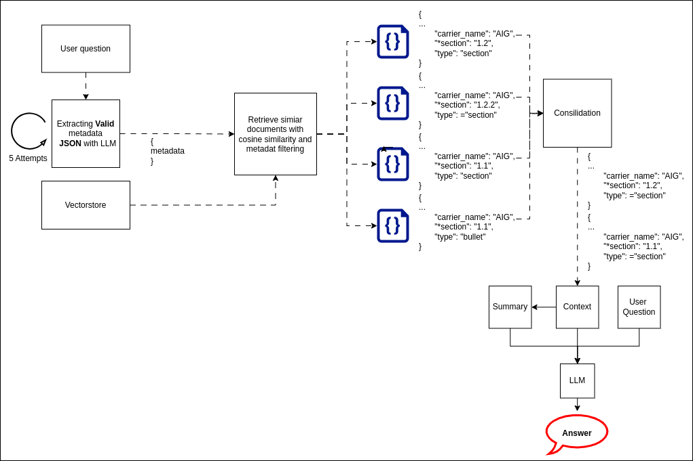

# Retrieval-Augmented Generation (RAG) System for Insurance Carrier Appetites

This project implements a Retrieval-Augmented Generation (RAG) system that helps insurance brokers quickly understand and compare carrier appetites for different types of risks. It processes carrier appetite guides, extracts structured metadata, and leverages a vector database and LLM to provide coherent and accurate responses to user questions.

## Table of Contents

1. [Overview](#overview)
2. [High Level Logic](#high-level-logic)
3. [Fined Grained Logic](#fined-grained-logic)
   - [Preprocessing & Vectorstore Creation](#preprocessing--vectorstore-creation)
   - [Retrieval](#retrieval)
   - [Consolidation](#consolidation)
   - [Final prompt](#final-prompt)
4. [Components](#components)
5. [Assumptions](#assumptions)
6. [Getting Started](#getting-started)
   - [Prerequisites](#prerequisites)
   - [Installation](#installation)
7. [Tools & Technologies](#tools--technologies)
8. [License](#license)

## Overview

The system takes carrier appetite guides, splits them into structured chunks with extracted metadata, and stores these in a vector store. When a user submits a question, the same metadata extraction is performed on the query. The system then retrieves the most relevant documents based on similarity and metadata matching, consolidates them to remove redundancy, and constructs a final prompt for a language model to generate a summary and answer.

---

## High Level Logic:

1. **Input Processing:**  
   Carrier appetite guides are segmented into hierarchical chunks based on markdown-like headings.

2. **Metadata Extraction:**  
   Each chunk is processed to extract key metadata, which is stored in a structured format.

The  **Input Processing** and **Metadata Extraction** are illustrated conceptually in .

3. **Document Retrieval:**  
   When a user asks a question, the system extracts similar metadata from the question and performs two kinds of searches in the vectorstore:
   - **Similarity Search** (using cosine similarity)
   - **Metadata Matching** (counting field matches)

4. **Result Consolidation:**  
   Retrieved documents are merged and redundant subsections are removed, ensuring a concise context for the final prompt.

5. **Response Generation:**  
   The consolidated text and its summary, along with the system prompt and user question, are sent to the LLM to generate the final answer.
   
The **Document Retrieval**, **Result Consolidation** and  **Response Generation** are illustrated conceptually in .

---

## Fined Grained Logic:

### **Preprocessing & Vectorstore Creation:**
   - Each carrier appetite guide is split into chunks based on sections indicated by the '#' characters.
   - Three types of sections are identified:
     - **full_doc:** The entire document.
     - **section:** A section within the document.
     - **bullet:** A one-line bullet point (lines starting with '-' or '*').
   - Each subsection inherits the names of its parent sections, following the hierarchy: **full_doc > section > bullet**.
   - Metadata is extracted from each chunk with the following structure:
     ```json
     {
       "coverage": [...],
       "capacity": [...],
       "limit": [...],
       "Natural_disaster.include": [...],
       "Natural_disaster.exclude": [...],
       "geographical_region.include": [...],
       "geographical_region.exclude": [...],
       "carrier_name": "...",
       "*section": "...",
       "*type": "full_doc" | "section" | "bullet"
     }
     ```
     *Note: All JSON values are saved as strings (e.g., `"[...]"`).*
   - An iterative LLM call (up to 5 attempts) is used to extract the metadata correctly. Fields may be missing but will not be nested or have different names.

### **Retrieval:**
   - When a user question is submitted, the system extracts similar metadata from the question.
   - Two types of searches are performed on the vectorstore:
     - **Similarity Search:** Retrieves the top `TOTAL_SIMILAR` results based on cosine similarity.
     - **Metadata Matching:** Retrieves documents by matching metadata fields. Two subgroups are defined:
       - The top `MOST_SIMILAR_NUM` records by similarity score.
       - The top `MOST_FILTER_NUM` records by metadata filter score (*where `MOST_SIMILAR_NUM` < `MOST_FILTER_NUM`*).
   - **Filter Score Calculation:** For each metadata field, the system checks if the user’s metadata value exists (as a partial match) within the document’s metadata values. For example:
     - **User Metadata:** `"Natural_disaster.include": "flood"`
     - **Document Metadata:** `"Natural_disaster.include": "['flood may be considered', 'fire']"`
     - In this case, the score increases by 1 because the word "flood" is present in the document's value.
   - A sanity check logs a warning if documents in the `MOST_SIMILAR_NUM` group do not appear in the `MOST_FILTER_NUM` group, as metadata should carry more information than the regular similarity score.

### **Consolidation:**
   - The two sets of retrieved documents are combined.
   - Duplicate subsections are removed by discarding any subsection that is already included in a higher-level section, thereby reducing redundancy.
   - The consolidated text is truncated to a maximum token count (tokens defined as whole words).
   - The final consolidated text is sent to the LLM to generate a summary.

### **Final Prompt:**
   - The prompt sent to the LLM consists of the following parts:
     - **System Prompt**
     - **Summary** of the consolidated documents
     - **Context** (the consolidated documents)
     - **User Question**


## Components

- **LLM API Calls:**  
  All interactions with the language model are performed through this component.

- **Logger:**  
  Logs the different stages of the pipeline for debugging and performance tracking.

- **Retriever:**  
  Handles the retrieval of documents from the vectorstore based on both similarity and metadata matching, and responds to user questions.

- **VectorDB:**  
  Parses carrier appetite guides, extracts metadata, creates chunks, and stores the information in the vector database.

---
## Assumptions

- Only one user question is asked at a time (no dialog support).
- Carrier appetite guides are relatively small.
- A top-tier LLM can generate coherent and polite responses when provided with the right system prompt.

---

## Getting Started

### Prerequisites
Python version 3.12.3 
Virtual environment

### Installation
1. **Clone the Repository:**
   ```bash
   git clone https://github.com/orlevit/broker-carrier-match
   cd broker-carrier-match
   ```
2. **Install dependencies:**
```bash
pip install -r requirements.txt
```
3. **Input:**
Put the input file "guide.json" in the foler "data/input".

4. **OpenAI key:**
Create .env file with these keys: OPENAI_API_KEY

5. **Usage:**
```bash
python main.py
```

---

## Tools & Technologies

- **Langchain**
- **ChatGPT**
- **Chroma**
- **Python**

## License

This project is licensed under the MIT License. See the [LICENSE](LICENSE) file for details.
